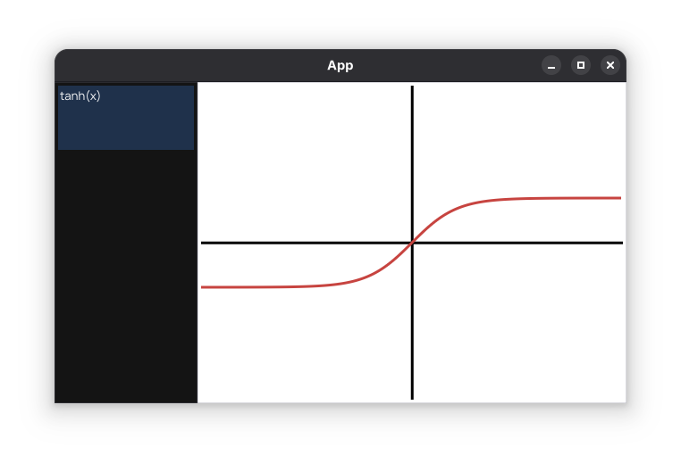

# ImGraph

A graphing calculator written in C++ with an ImGui user interface rendered with SDL2

## How to get started

The codebase of this repo is quite big, but the file that is of interest to you as a contributor is [
`src/code/Core/Application.cpp`](src/core/Core/Application.cpp). It contains the code for parsing expressions 
(using [ExprTk](https://github.com/ArashPartow/exprtk)) and the rendering logic for calculating the graph's points. Most,
if not all features can be implemented by only modifying this one file.

Have a look at the file, ExprTk is quite easy to get used to (a quick look at the documentation is all you need), and most of the ImGui logic should be trivial to implement if you have developed a GUI program before.

A high-school level understanding of coordinate geometry is required to implement many features listed in the [issues](https://github.com/OPCODE-Open-Spring-Fest/ImGraph/issues).

Happy contributing!
